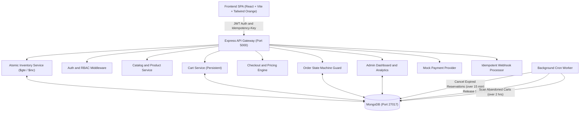

# ZETO | E-Commerce Order Processing & Inventory System
> **Appzeto Machine Test — Task 3 Full-Stack Implementation**  
> Complete end-to-end production-grade application featuring real-time atomic inventory reservation, strict order state machine, mock payment simulator, idempotent webhook handler, and real-time admin analytics dashboard.

---

## 1. Project Overview

ZETO is a resilient e-commerce platform designed to eliminate overselling and handle edge-case concurrency failures. Built to fulfill all technical requirements of **Appzeto Machine Test Task 3**, this system provides:
- **Zero Frontend Trust**: All discounts, taxes, and shipping fees are computed strictly by the server.
- **Atomic Concurrency**: Simultaneous checkout requests against constrained stock are protected at the database level using atomic conditional updates (`$gte` and `$inc`).
- **Order State Machine**: Rejects invalid order status jumps (e.g. `DELIVERED -> PENDING`).
- **Mock Payment Simulation**: Supports `SUCCESS`, `FAILED`, and `TIMEOUT` outcomes with immediate inventory rollback on failures.
- **Idempotency**: Safe request deduplication on orders, payments, and payment webhooks via `Idempotency-Key` headers.
- **Persistent Cart**: Persists across browser refreshes and sessions.
- **Admin Dashboard**: Real-time sales analytics, low-stock warnings, top products, and live order/product search.

---

## 2. Tech Stack

- **Frontend**: React 18, Vite, TypeScript, Tailwind CSS (Vibrant Orange & Amber theme: `#f97316`, `#ea580c`), Lucide React, Axios.
- **Backend**: Node.js, Express.js (TypeScript), Helmet, CORS, Morgan, Express-Validator.
- **Database**: MongoDB (v8) with Mongoose ORM, compound indexes, text indexes.
- **Testing**: Jest, Supertest, ts-jest (15 comprehensive automated test suites covering concurrency, idempotency, state transitions, payments, and webhooks).
- **Background Worker**: In-memory scheduled cron engine managing 15-minute reservation timeouts and abandoned carts.

---

## 3. Architecture



---

## 4. Database Structure & Indexing Strategy

### 4.1 Models & Schemas

1. **User (`users`)**:
   - `email` (indexed, unique, lowercase)
   - `passwordHash` (bcrypt)
   - `role` (`'USER'` | `'ADMIN'`, indexed)
   - `addresses`: Array of shipping addresses
2. **Product (`products`)**:
   - `name`, `slug` (unique, indexed), `category` (indexed), `sku` (unique, indexed)
   - `stock` (overall available quantity)
   - `variants`: Array of `{ sku, size, color, price, discountPercent, stock }`
   - `lowStockThreshold` (default 5)
   - **Indexes**:
     - Compound text index: `{ name: 'text', description: 'text', category: 'text' }`
     - Variant SKU index: `{ 'variants.sku': 1 }`
3. **Cart (`carts`)**:
   - `userId` (unique, indexed, ref User)
   - `items`: Array of `{ productId, variantSku, quantity }`
   - `updatedAt` (used by background job for abandoned cart detection)
4. **Order (`orders`)**:
   - `orderNumber` (unique, indexed, e.g. `ORD-YYYYMMDD-XXXX`)
   - `userId` (ref User, indexed)
   - `items`: Snapshot of items, quantities, and locked prices
   - `pricing`: `{ subtotal, discountTotal, tax, shipping, finalTotal }`
   - `status`: Order state machine enum
   - `statusHistory`: Array of `{ status, timestamp, note }`
   - `reservationExpiresAt`: Date (indexed)
   - `idempotencyKey`: String (sparse, indexed)
   - **Indexes**: `{ createdAt: -1 }`, `{ orderNumber: 1, status: 1 }`
5. **Payment (`payments`)**:
   - `orderId` (ref Order, indexed)
   - `transactionId` (unique, indexed)
   - `status`: `'PENDING'` | `'SUCCESS'` | `'FAILED'` | `'TIMEOUT'`
   - `webhookDelivered`: Boolean
   - `webhookDeliveredAt`: Date
6. **IdempotencyRecord (`idempotencyrecords`)**:
   - `key`: Unique idempotency key (indexed)
   - `responseStatus`: HTTP response code
   - `responseBody`: JSON body
   - `createdAt`: Date (TTL index expiring automatically after 24 hours: `expires: 86400`)

---

## 5. Concurrency & Zero-Overselling Strategy

### Problem Statement
If a product has `stock = 5` and 20 users simultaneously check out one unit, only 5 orders must succeed, 15 must be rejected, and stock must never become negative.

### Implementation
1. **Atomic Conditional Updates**:
   Stock is reserved using atomic `$gte` checks and `$inc` in a single MongoDB operation:
   ```typescript
   const product = await Product.findOneAndUpdate(
     {
       _id: item.productId,
       'variants.sku': item.variantSku,
       'variants.stock': { $gte: item.quantity },
       stock: { $gte: item.quantity }
     },
     {
       $inc: {
         'variants.$.stock': -item.quantity,
         stock: -item.quantity
       }
     },
     { new: true }
   );
   ```
2. **Multi-Item Atomic Rollback**:
   If an order contains multiple items and Item #1 succeeds but Item #2 fails due to stock shortage, the system catches the failure, iterates backwards, and restores stock for Item #1 via atomic `$inc` with `+quantity`.
3. **Automated Concurrency Proof**:
   Validated by `ecommerce.test.ts` where 20 parallel requests compete for 5 items:
   - Exactly 5 succeed (`HTTP 201`).
   - Exactly 15 fail (`HTTP 400`).
   - Remaining stock in database is verified to be exactly `0`, never negative.

---

## 6. Checkout Pricing & Rule-Based Shipping

The backend calculates all order values with zero trust in client payloads:
$$\text{Net Subtotal} = \text{Subtotal} - \text{Discount}$$
$$\text{Tax} = \text{Net Subtotal} \times 0.10 \quad (10\%)$$
$$\text{Shipping} = \begin{cases} \$0 & \text{if Net Subtotal} \ge \$100 \\ \$15.00 & \text{otherwise} \end{cases}$$
$$\text{Final Total} = \text{Net Subtotal} + \text{Tax} + \text{Shipping}$$

---

## 7. Order State Machine

Transitions are enforced by `validateTransition(currentStatus, targetStatus)`:

```text
       PENDING
          │
  PAYMENT_PROCESSING
          │
        PAID ────► REFUNDED
          │
      PROCESSING
          │
       SHIPPED
          │
      DELIVERED ──► REFUNDED
```
**Failure States**: `PAYMENT_FAILED`, `CANCELLED`, `REFUNDED`.  
Invalid transitions (e.g. `DELIVERED -> PENDING` or `CANCELLED -> PAID`) throw an immediate `HTTP 400` error.

---

## 8. Idempotency & Payment Webhooks

### 8.1 Idempotency-Key
- Supported on `POST /api/orders` and `POST /api/payments`.
- If an `Idempotency-Key` header is re-sent, the server returns the cached response with `X-Idempotent-Replay: true` header without creating a duplicate order or re-deducting stock.

### 8.2 Payment Webhook (`POST /api/webhooks/payment`)
- Handles asynchronous payment gateway events (`payment.success`, `payment.failed`).
- **Deduplication Guard**: Verifies `webhookDelivered` flag. Duplicate deliveries return `{ idempotent: true, message: 'already processed' }` with `HTTP 200` without triggering secondary status transitions or inventory discrepancies.

---

## 9. Background Jobs (Worker Engine)

Runs every 30 seconds via an in-memory background worker:
1. **Expired Reservation Cleanup**:
   Orders in `PENDING` or `PAYMENT_PROCESSING` older than 15 minutes are automatically updated to `CANCELLED`, and their reserved items are restored back to inventory.
2. **Abandoned Cart Detection**:
   Carts with unpurchased items inactive for $>2$ hours are flagged for recovery reminders.
3. **Order Confirmation Simulation**:
   Logs automated email dispatch events when an order is created.

---

## 10. API Documentation

| Method | Endpoint | Auth | Description |
|---|---|---|---|
| `POST` | `/api/auth/register` | Public | Register new user or admin |
| `POST` | `/api/auth/login` | Public | Login and receive JWT |
| `GET` | `/api/auth/profile` | Bearer | Get user profile and addresses |
| `GET` | `/api/products` | Public | Get products with search, category, sort |
| `GET` | `/api/products/:id` | Public | Get product details with size & color variants |
| `POST` | `/api/products` | Admin | Create product with variants |
| `PUT` | `/api/products/:id` | Admin | Update product information or stock |
| `DELETE` | `/api/products/:id` | Admin | Delete product |
| `GET` | `/api/cart` | Bearer | Get user persistent cart and pricing |
| `POST` | `/api/cart/items` | Bearer | Add variant to cart |
| `PATCH` | `/api/cart/items/:id` | Bearer | Update item quantity |
| `DELETE` | `/api/cart/items/:id` | Bearer | Remove item from cart |
| `POST` | `/api/orders` | Bearer | Create order with atomic reservation |
| `GET` | `/api/orders` | Bearer | Get user orders or search all orders (Admin) |
| `GET` | `/api/orders/:id` | Bearer | Get order details and state audit history |
| `POST` | `/api/orders/:id/cancel` | Bearer | Cancel order and release reserved stock |
| `PATCH` | `/api/orders/:id/status` | Admin | Manually advance order in state machine |
| `POST` | `/api/payments` | Bearer | Process mock payment (`SUCCESS` / `FAILED` / `TIMEOUT`) |
| `POST` | `/api/webhooks/payment` | Public | Idempotent payment webhook handler |
| `GET` | `/api/admin/dashboard` | Admin | Revenue, orders, low-stock, top products, sales chart |

---

## 11. Environment Variables

Create `.env` inside `backend/`:
```env
PORT=5000
MONGODB_URI=mongodb://127.0.0.1:27017/zeto_ecommerce
JWT_SECRET=super_secret_jwt_key_zeto_ecommerce_2026
FRONTEND_URL=http://localhost:5173
NODE_ENV=development
```

---

## 12. Setup & Execution Instructions

### Prerequisites
- Node.js (>= v18, tested on v22.20.0)
- MongoDB running on `mongodb://127.0.0.1:27017`

### 1. Install Dependencies
```bash
# Backend
cd backend
npm install

# Frontend
cd ../frontend
npm install
```

### 2. Seed Database
Pre-populates sample catalog products with size/color variants and default users:
```bash
cd backend
npm run seed
```
**Default Credentials**:
- **Customer**: `customer@zeto.com` / `Customer@123`
- **Admin**: `admin@zeto.com` / `Admin@123`

### 3. Run Development Servers
```bash
# Terminal 1: Backend (runs on http://localhost:5000)
cd backend
npm run dev

# Terminal 2: Frontend (runs on http://localhost:5173)
cd frontend
npm run dev
```

### 4. Run Automated Tests
```bash
cd backend
npm test
```

---

## 13. Security Considerations

- **SQL / NoSQL Injection Protection**: MongoDB queries use parameterization and regex sanitization; raw objects are not evaluated.
- **XSS & Headers**: Helmet middleware sets CSP, HSTS, X-Content-Type-Options, and frame restrictions.
- **Broken Authorization**: RBAC (`requireAdmin`) strictly enforced at the API route layer. Regular users cannot access `/api/admin/*` or view orders belonging to other accounts.
- **Data Exposure**: Passwords hashed with `bcrypt` (10 rounds); password hashes excluded from user queries.
- **Safe Structured Errors**: Central error handler prevents leaking stack traces to clients.

---

## 14. Known Limitations & 2-Hour Machine Test Tradeoffs

1. **In-Memory Background Worker**:
   Used an in-process cron timer instead of full Redis + BullMQ / RabbitMQ infrastructure to remain within the 2-hour machine test timeframe.
2. **Mock Payment Provider**:
   Payments and webhooks are simulated locally with SUCCESS / FAILED / TIMEOUT options rather than an external Stripe / Razorpay sandbox.
3. **Rule-Based Shipping**:
   Calculated via simple threshold logic ($\ge \$100$ free, else $\$15$) rather than external courier API integration.

---

## 15. What Would Be Improved With Another 2 Days

1. **Distributed Queues**: Integrate BullMQ with Redis for fault-tolerant background queue processing and worker scaling.
2. **MongoDB Replica Set Transactions**: Wrap multi-collection cart/order/payment flows into distributed two-phase commit sessions.
3. **Real Payment Gateway**: Integrate Stripe Elements with webhook signature verification (`stripe-signature`).
4. **Export & Invoicing**: PDF invoice generator for customers and CSV sales reports for admins.
5. **Elasticsearch / Atlas Search**: Faceted full-text search with typo tolerance and auto-complete.
